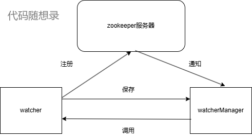

# 10、面试问题

## 为什么做RPC框架，这是不是学习类的项目

先让大家了解背景，这段内容面试不用说：

RPC 项目 基本都是 学习项目 （可以说99.99%）。 

即使已经工作的录友，公司基本也不会 起项目 亲自去造一个 RPC轮子，都是用现成的开源框架，所以 工作的录友如果简历上写RPC也是学习类项目。 

你在面试中回答：自己在学习的时候，了解到 分布式，就好奇，不同机器之间 是如何通信的，然后了解到了 RPC，发现可以 像本地调用函数一样方便，调用其他服务器的函数。 感觉很神奇，就像自己实现一遍。

## 1.简单描述项目、实现了怎么样的功能？用了那些技术栈

这个项目是基于C++语言实现的一个RPC分布式网络通信框架项目，使用CMake在Linux平台上构建编译环境。它可以将任何单体架构系统的本地方法调用重构为，基于TCP网络通信的RPC远程方法调用。该框架实现了同一台机器不同进程之间或不同机器之间服务调用。它适用于将**单体**架构系统拆分为基于**分布式微服务调用**的部署。

网络层采用了高并发的Reactor网络模型muduo开源网络库实现。这使得网络IO层和RPC方法调用处理层进行代码解耦变得更加容易，并且具有良好的并发性能。RPC方法调用使用了**protobuf**进行相关数据的**序列化和反序列化**，**zookeeper**提供了服务器的注册和发现。

***

## 2.为什么要使用Zookeeper作为服务器注册与发现中心？

\*\*回答建议：\
\*\*回答时，可以简要说明Zookeeper的核心功能，突出其优势和缺点，体现你对zookeeper的理解。

**示例：**

\*\*"\*\*Zookeeper是一个分布式协调工具，特别适用于分布式环境中的服务注册与发现。它的优点是高可用性和一致性，通过Wathcer机制可以实时感知服务的上线和下线。Zookeeper使用ZAB协议保证数据的一致性，确保每个节点的数据更新都说线性化的。不过，它的缺点是：对于写操作吞吐量不高，可能会成为拼接，尤其在大规模集群中。"

***

## 3.消息传输为什么用protobuf,而不用json?

\*\*回答建议：\*\*可以对比二者的区别，protobuf主要是二进制的序列化数据，json主要是纯文本。

**示例：**

* 首先Json协议是典型的Key-Value明文协议，用起来相当方便，但是用Json序列化后的空间开销比较大，性能不行。
* Hsessian是动态类型、二进制、紧凑的、可跨语言移植的一种序列化框架，序列化后的二进制数据比Json紧凑高效。
* Protobuf序列化体积比JSON和Hession小很多，序列化和反序列化速度也很快，消息格式升级，跨平台兼容性也不错

## 4.在实现 RPC 服务时遇到了哪些难点？你是如何解决的

\*\*回答示例：\*\*这里可以参考简历如何写模块中介绍过的项目难点。

**示例：**

1.沾包/拆包问题：通过自定义通信协议(消息头+消息体)解决，确保数据完整性。

2.Zookeeper的学习与使用：

* 学习Wathcher机制，监听节点变化，实现动态服务注册与发现。
* 将Zookeeper作为注册中序，提供高可用性和实时更新能力。

3.Protobuf的序列化和反序列化：熟悉Protobuf的定义文件、编译工具和API使用，确保高效传输数据。

4.高并发网络处理：通过Muduo网络库提供事件循环与线程池，实现高性能并发。

## 5. 如何处理分布式系统中的故障？你在项目中采取了哪些措施确保系统的高可用性？

**回答建议：**\
展示你对高可用性、容错和恢复机制的理解，并结合项目经验说明具体做法。

**示例：**\
“在分布式系统中，故障不可避免，所以高可用性设计非常重要。我在项目中使用了如下措施：

* **服务注册与发现**：通过 Zookeeper 实现服务的动态注册与发现，当某个服务宕机时，客户端可以自动从 Zookeeper 获取新的服务节点信息。
* **超时重试**：客户端调用服务时设置超时，如果服务未响应，则会重试一定次数。
* **负载均衡**：使用负载均衡策略，保证请求均匀分配到多个服务实例上，避免单点故障。
* **故障熔断与降级**：当某个服务连续失败时，启动熔断机制，停止调用该服务，避免影响整个系统。”

## 6. 为什么选择 Glog 作为日志库？它有哪些优点？

\*\*回答示例：\*\*可以按照日志库模块中提到的内容回答，为什么要选择Glog。

**示例：**

选择Glog主要因为其具有以下优点：

1.高性能：Glog支持异步输出，性能消耗较低，适合高并发场景。

2.线程安全：在多线程环境下保证日志写入的安全性，避免日志冲突。

3.日志等级分类：支持不同级别日志(INFO、WARNING、ERROR、FATAL)，开发者可以通过等级快速定位问题。

4.自动分割日志：支持按大小或日期进行日志文件分割，方便日志管理。

5.崩溃记录：在程序崩溃时可以生成堆栈信息，帮助诊断问题。

## 7.请简要解释一下RPC(远程过程调用)是什么，它是如何工作的？

\*\*回答建议:\
\*\*回答时要简明扼要，涵盖 RPC 的原理和工作流程。

**示例：**

Rpc是一种通过网络从远程计算机请求服务的协议。它的核心思想是，客户端通过代理调用服务端的方法，像调用本地方法一样，透明的隐藏了网络通信的细节。RPC的工作过程通常包括：

1.客户端发起请求，调用服务端的代理，序列化请求数据

2.通过网络传输到服务端。

3.服务端通过客户端的代理，进行反序列化数据。

4.处理请求方法生成响应，在通过客户端代理序列化返回客户端。

## 8.你如何看待微服务架构与传统单体应用架构的区别？

**回答建议：**

主要是展示你对微服务架构和传统单体架构的理解。

**示例：**

微服务架构通过将一个大型应用拆分为多个独立、自治的服务，能够提升系统的灵活性、可扩展性和可维护性。微服务算是分布式应用的一个重要基础，相较于传统单体架构，微服务具有以下优势：

1.独立部署与扩展：每个服务都可以独立部署，单个服务出现故障，并不会影响整个系统。

2.高可用性：服务之间的低耦合涉及，使得服务出现故障时可以快速的隔离。

3.技术栈的灵活：不同服务可以使用不同的技术栈，适应各自业务的需求。

但微服务架构也带来了一些挑战，如服务间通信、分布式事务处理和数据一致性等问题。

## 9.TCP粘包与拆包问题解决方案

请详细描述TCP粘包和拆包问题的成因。在您的项目中，您是如何设计自定义消息格式和编解码器来解决这些问题的？具体实现步骤是什么？

**回答：**

**1.首先是TCP粘包的成因：**

TCP是流式协议，数据是按字节流传输的，没有明确的消息边界可能会导致：

应用层会发送数据过于频繁或者来不及接收：多个小包被TCP缓冲区合并，就会导致粘包。

Nagle算法：Nagle算法将小数据包合并后再发送，进一步导致粘包。

例如：发送方连续发送两条消息 `msg1="hello"` 和 `msg2="world"`，接收方可能一次性接收到 `helloworld`。

**2.TCP拆包的成因：**

由于TCP传输是分段发送，可能出现以下情况：

消息过大：一条消息的长度超过TCP缓冲区的大小，分多个包传输。

网络拥塞或延迟：导致分包后不同时间接收到数据。

**解决：**

**通过自定义的协议和编码器/解码器，这一部分可以看看channel和provider(OnMessage)中如何做的。**

## 10.Zookeeper的Watcher机制

解释Zookeeper的Watcher机制的工作原理。在您的项目中，如何利用Watcher机制实现服务的动态感知（如服务上线/下线）？请举例说明Watcher事件的处理流程。

**回答**

在回答之前你不妨思考一下Wathcer是什么？按中文的意思是一个观察者，欧克这个观察者做了什么？在本项目中使用zookeeper的目的是为了等到zookeeper客户端连接成到服务端来通知，初始化成功，然后client客户端就可以从zk的服务器上获取服务器对象和方法名。

但是具体是怎么做？

搞个小图有图好分析。

wathcher主要是用来监视服务端，如果服务端发生了什么变化就要通知给客户端。不过你要想服务端通知客户端，客户端必须先往上面注册一个对某个节点的watch事件，服务端发给watch事件通知，但这个通知是不会返回节点数据，只是告知客户端你要我监听的节点发生变化了，具体的处理逻辑可以通过捕获告知的事件类型进行相应的操作，\*\*但是Wathcer事件只能用一次，也就是用完就没不过3.6.0版本后增加了永久递归wathcher，\*\*这个我没去了解。

客户端向服务端注册了wathcer事件之外，还需要将这个wathcer回调事件保存在watcherManager上，这样服务端通知就会通知watcherManager执行保存在wathcerManager的回调函数。

## 11.Muduo Reactor网络模型

请解释Muduo Reactor网络模型的核心概念和工作流程。在您的项目中，如何利用Muduo实现高并发网络通信？具体是如何进行网络IO与RPC方法调用的解耦设计的？

**回答：**

1.核心概念和工作流程：[参考muduo库笔记](https://zhuanlan.zhihu.com/p/495016351)

2.如何利用Muduo实现高并发网络通信：

* 网络层设计
  * 非阻塞IO
  * 连接管理
  * 事件循环线程
* 多线程的模型
  * 主线程负责IO
  * 工作线程池

3.具体是如何进行网络IO与RPC方法调用的解耦设计的？

* 自定义消息协议(说了很多了就不多说了)
* 编解码器设计  (就是我们序列化和反序列化的设计)

## 12.自定义通信协议设计

您在项目中设计了怎样的自定义通信协议？请详细描述消息格式的设计思路，以及如何确保数据传输的完整性和高效性。此外，如何处理协议版本升级和兼容性问题？

回答示例：

这里自定义的过程上面有交代，数据怎么传输完整性如何这不就是我们选择protobuf的目的吗？兼容性跨平台，支持向前向后纠错。

回答：

略。

## 13.服务注册与发现的高可用性保障

在服务注册与发现过程中，如何确保服务注册中心的高可用性和一致性？如果Zookeeper集群中的一个节点发生故障，系统如何处理以保证服务的持续可用？

**回答示例：**

这里就是看你选择了说明配置中心，这里我们使用了zookeeper的服务中心本身就满足了强一致性。当zookeeper一个节点在集群中发生故障，这里可以参考星球资源中的raft，当故障的节点不超过集群的一半以上就不会停止对外的服务。

\*\*回答：\*\*略。

## 14.高性能日志系统的实现

您是如何集成Glog日志库并实现高性能、线程安全的日志系统的？请解释Glog在多线程环境下如何保证日志记录的正确性和效率。此外，您是如何配置和使用不同的日志等级来辅助调试的？

**回答：**

借助日志库glog自带的异步写入和线程安全，以及高性能，考虑兼容性引入我们的rpc项目，作为其高效的日志库。并且为了其不影响执行的效果，主要打印的日志还是采用ERROR的优先级去打印，为此专门封装了一个类进行响应的方法调用。

**如果大家有疑问对Glog在多线程环境下如何保证日志记录的正确性和效率。**

**1.Glog的线程安全性设计：**

1.线程安全的写入机制

内部锁机制：

Glog使用线程锁(例如std::mutex或其他锁机制)来保护共享资源的访问，比如日志文件的写入操作或内存缓冲区的管理。

单个线程持有锁：

每次只有一个线程能够写入日志文件，避免多线程同时写入时出现混乱或数据竞争。

2.日志缓冲区

* 每线程独立缓冲区：

Glog为每个线程分配独立的日志缓冲区(ThreadLocal变量)。当多个线程同时写日志时，日志内容会先写入线程自己的缓冲区，减少对全局锁的竞争。

* 批量写入：

缓冲区满了之后，Glog才会将数据刷新到日志文件中，从而减少频繁写磁盘的开销。

3.写文件的延迟加载

Glog只有在真正需要写日志文件时(如缓冲区满、程序退出)才会将日志内容从内容中写入磁盘避免频繁

**2.异步写入的实现**

虽然Glog并非严格意义上的异步日志库(如spdlog的异步模式)，但它的设计中有一些类似异步写入的特性：

1.日志写入分离

Glog会将日志写入的逻辑与用户调用Log(INFO)等代码的逻辑分离。用户线程只需要将日志数据写入内存缓冲区，具体的磁盘写入由专门的线程(或同步机制完成)。

2.后台线程的日志刷新

在默认配置下，Glog的后台线程会周期性地刷新日志缓冲区，将日志内容从内存写入磁盘文件。这种方式避免了用户线程在写日志时阻塞。

3.日志的自动管理

当程序崩溃时，Glog的Fatal级别日志会立即将所有缓冲区内容写入磁盘，以便保留关键错误的信息。

> 更新: 2025-05-19 11:36:41  
> 原文: <https://www.yuque.com/chengxuyuancarl/hwfg8r/skkr7xi3pcm41ufi>