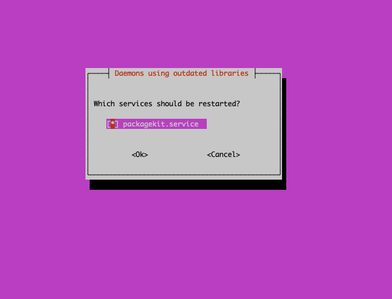
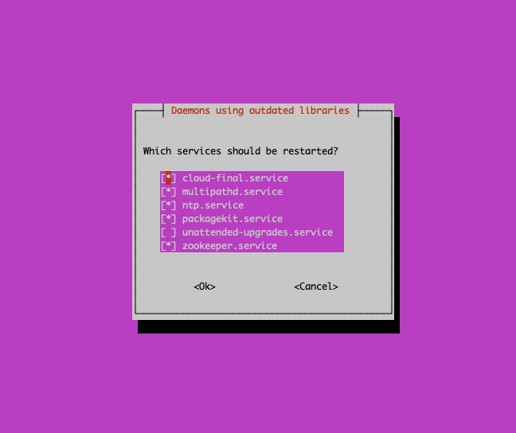
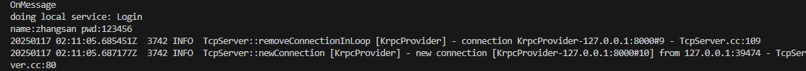
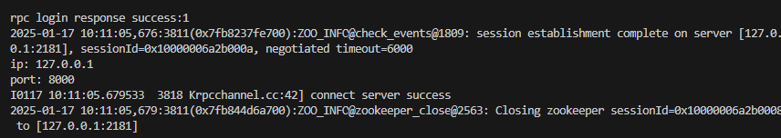
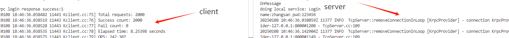

# 1、开篇

## 学习时间（必看）

1、如果是有C++语法基础的友友，比如做过代码随想录知识星球理的：基于Raft共识算法的KV数据库，协程库等的朋友。

那你们上手这个项目的时间会非常快，具体：

**<font style="color:#DF2A3F;">学习时间：一天只需要抽3-4个小时，看5天左右基本能看完整个项目。</font>**

2、但是学习这个项目的大多数可能还是新手，那么我建议一定要按顺序一步步的去了解为什么要做这个项目。所以我这里给一个大概的时间仅供参考！！

**<font style="color:#DF2A3F;">学习时间：一天需要6-8小时，看15-20天基本能完成KRpc项目。</font>**

最后对于有不理解的文章的内容或者疑惑都可以提问！

本项目代码1000行左右，但是还有很多地方可以拓展。

项目地址：<https://github.com/youngyangyang04/Krpc> 。

欢迎一起学习！

建议大家买个云服务器用来学习，配置环境，比自己装虚拟机方便太多了，而且虚拟机的环境经常出莫名其妙的问题。

* [<font style="color:rgb(62, 175, 124);">阿里云活动期间服务器购买(opens new window)</font>](https://www.aliyun.com/minisite/goods?taskCode=shareNew2205\&recordId=3641992\&userCode=roof0wob)
* [<font style="color:rgb(62, 175, 124);">腾讯云活动期间服务器购买</font>](https://curl.qcloud.com/EiaMXllu)

## <font style="color:rgb(31, 35, 40);">运行Ubuntu版本</font>

```plain
Ubuntu 22.04 LTS
```

## 一键安装环境脚本：

以下安装最好使用纯净的Ubuntu 22.04 LTS，避免其他环境影响安装。

脚本的使用：

```shell
第一步：进入到根目录下，命令如下：
cd ~
第二步：下载链接，命令如下：
wget https://www.programmercarl.com/download/build_rpc_1.sh
第三步：添加脚本执行权限：
chmod +x build_rpc_1.sh
第四步：运行脚本
./build_rpc_1.sh

```

这个脚本主要是帮助大家配置好muduo库的环境，以及将muduo库的头文件和lib文件移动到相应的位置上，防止项目include\<muduo头文件>失败。

如果安装遇到以下情况：

遇到如下页面一件敲回车，继续执行就可以。





\*\*注意：**运行了脚本就不需要接着处理**自己部署环境，\*\*脚本已经都安装好了。

***

## <font style="color:rgb(31, 35, 40);">自己部署环境 </font>

1.安装基础工具

```shell
sudo apt-get install -y wget cmake build-essential unzip
```

2.[muduo安装](https://blog.csdn.net/QIANGWEIYUAN/article/details/89023980)

zookeeper:

3.安装 Zookeeper：

```shell
sudo apt install zookeeperd
```

3.1.安装 Zookeeper 开发库：

```shell
sudo apt install libzookeeper-mt-dev
```

4.protoc，本地版本为3.12.4，一定要**使用ubuntu22**使用：

```shell
sudo apt-get install protobuf-compiler libprotobuf-dev  
```

<font style="color:rgb(31, 35, 40);">5.安装boost库</font>

```shell
sudo apt-get install -y libboost-all-dev
```

6.glog安装：

```shell
sudo apt-get install libgoogle-glog-dev libgflags-dev
```

如果安装遇到以下情况：

遇到如下页面一件敲回车，继续执行就可以。


### 关于git仓库Zoo\_exits异常问题：

主要原因是<font style="color:rgb(64, 64, 64);">这个错误表明在尝试从华为云镜像站下载 </font><code>**<font style="color:rgb(64, 64, 64);background-color:rgb(236, 236, 236);">openjdk-11-jre-headless</font>**</code><font style="color:rgb(64, 64, 64);"> 软件包时遇到了 404 错误（文件未找到）。这通常是因为软件包的版本在镜像站中已被更新或移除。以下是解决方案：</font>

<font style="color:rgb(64, 64, 64);">先运行：</font>

```bash
更新软件源缓存：
sudo apt-get update
再次尝试安装：
sudo apt-get install --fix-missing openjdk-11-jre-headless
```

***

## <font style="color:rgb(31, 35, 40);">代码编译指令</font>

```shell
第一步：进入到krpc文件
cd Krpc

第二步：生成项目可执行程序
mkdir build && cd build && cmake .. && make -j${nproc}

第三步：然后进入到example文件夹下，找到user.proto文件执行以下命令,会生成user.pb.h和user.pb.cc：
cd example
protoc --cpp_out=. user.proto

第四步：进入到src文件下，找到Krpcheader.proto文件同样会生成如上pb.h和pb.cc文件
cd src
protoc --cpp_out=. Krpcheader.proto

第五步：进入到bin文件夹下,分别运行./server和./client，即可完成服务发布和调用。
进入bin文件:
cd bin

运行server可执行程序:
./server -i ./test.conf

运行client可执行程序：
./client -i ./test.conf
```

***

## <font style="color:rgb(31, 35, 40);">运行结果</font>

<font style="color:rgb(31, 35, 40);">通过运行</font><font style="color:rgb(31, 35, 40);"> </font><code><font style="color:rgb(31, 35, 40);background-color:rgba(129, 139, 152, 0.12);">bin</font></code><font style="color:rgb(31, 35, 40);"> </font><font style="color:rgb(31, 35, 40);">目录下的</font><font style="color:rgb(31, 35, 40);"> </font><code><font style="color:rgb(31, 35, 40);background-color:rgba(129, 139, 152, 0.12);">server</font></code><font style="color:rgb(31, 35, 40);"> </font><font style="color:rgb(31, 35, 40);">和</font><font style="color:rgb(31, 35, 40);"> </font><code><font style="color:rgb(31, 35, 40);background-color:rgba(129, 139, 152, 0.12);">client</font></code><font style="color:rgb(31, 35, 40);">，可以观察到以下结果。以下是运行日志中的关键步骤和解析：</font>

***

### <font style="color:rgb(31, 35, 40);">服务端运行结果</font>



* **<font style="color:rgb(31, 35, 40);">运行结果说明</font>**<font style="color:rgb(31, 35, 40);">：该图展示了服务器成功启动并监听客户端请求的状态。</font>

**<font style="color:rgb(31, 35, 40);">服务器日志解析</font>**<font style="color:rgb(31, 35, 40);">：</font>

* <code><font style="color:rgb(31, 35, 40);background-color:rgba(129, 139, 152, 0.12);">doing local service: Login</font></code>
  * <font style="color:rgb(31, 35, 40);">表示客户端发起对服务</font><font style="color:rgb(31, 35, 40);"> </font><code><font style="color:rgb(31, 35, 40);background-color:rgba(129, 139, 152, 0.12);">Login</font></code><font style="color:rgb(31, 35, 40);"> </font><font style="color:rgb(31, 35, 40);">的调用。</font>
* <code><font style="color:rgb(31, 35, 40);background-color:rgba(129, 139, 152, 0.12);">name: zhangsan pwd: 123456</font></code>
  * <font style="color:rgb(31, 35, 40);">客户端向服务端发送了用户名</font><font style="color:rgb(31, 35, 40);"> </font><code><font style="color:rgb(31, 35, 40);background-color:rgba(129, 139, 152, 0.12);">zhangsan</font></code><font style="color:rgb(31, 35, 40);"> </font><font style="color:rgb(31, 35, 40);">和密码</font><font style="color:rgb(31, 35, 40);"> </font><code><font style="color:rgb(31, 35, 40);background-color:rgba(129, 139, 152, 0.12);">123456</font></code><font style="color:rgb(31, 35, 40);">。</font>
* <code><font style="color:rgb(31, 35, 40);background-color:rgba(129, 139, 152, 0.12);">new connection</font></code>
  * <font style="color:rgb(31, 35, 40);">客户端成功与服务端建立了一条新连接。</font>

***

### <font style="color:rgb(31, 35, 40);">客户端运行结果</font>



* **<font style="color:rgb(31, 35, 40);">运行结果说明</font>**<font style="color:rgb(31, 35, 40);">：该图展示了客户端成功连接到服务器并发送请求的状态。</font>

**<font style="color:rgb(31, 35, 40);">客户端日志解析</font>**<font style="color:rgb(31, 35, 40);">：</font>

* <code><font style="color:rgb(31, 35, 40);background-color:rgba(129, 139, 152, 0.12);">rpc login response success:1</font></code>
  * <font style="color:rgb(31, 35, 40);">表示客户端的登录请求成功，服务器返回响应值</font><font style="color:rgb(31, 35, 40);"> </font><code><font style="color:rgb(31, 35, 40);background-color:rgba(129, 139, 152, 0.12);">1</font></code><font style="color:rgb(31, 35, 40);">。</font>
* <code><font style="color:rgb(31, 35, 40);background-color:rgba(129, 139, 152, 0.12);">session establishment complete on server</font></code>
  * <font style="color:rgb(31, 35, 40);">表示与 Zookeeper 的会话成功建立，服务端已注册在 Zookeeper 中。</font>
* <code><font style="color:rgb(31, 35, 40);background-color:rgba(129, 139, 152, 0.12);">connect server success</font></code>
  * <font style="color:rgb(31, 35, 40);">表示服务端成功连接到目标地址。</font>

***

### <font style="color:rgb(31, 35, 40);">最终运行结果</font>

<font style="color:rgb(31, 35, 40);">通过运行</font><font style="color:rgb(31, 35, 40);"> </font><code><font style="color:rgb(31, 35, 40);background-color:rgba(129, 139, 152, 0.12);">bin</font></code><font style="color:rgb(31, 35, 40);"> </font><font style="color:rgb(31, 35, 40);">目录下的</font><font style="color:rgb(31, 35, 40);"> </font><code><font style="color:rgb(31, 35, 40);background-color:rgba(129, 139, 152, 0.12);">server</font></code><font style="color:rgb(31, 35, 40);"> </font><font style="color:rgb(31, 35, 40);">和</font><font style="color:rgb(31, 35, 40);"> </font><code><font style="color:rgb(31, 35, 40);background-color:rgba(129, 139, 152, 0.12);">client</font></code><font style="color:rgb(31, 35, 40);"> </font><font style="color:rgb(31, 35, 40);">可执行程序，最终结果如下：</font>



* **<font style="color:rgb(31, 35, 40);">最终结果说明</font>**<font style="color:rgb(31, 35, 40);">：该结果表明客户端与服务端成功完成了一次 RPC 通信，包括服务调用、请求处理和结果返回，验证了框架的稳定性和功能性。</font>

# c++rpc项目背景与动机

在现代分布式系统中，随着微服务架构的普及和系统复杂度的提升，服务之间的通信成为系统设计的核心问题之一。传统的本地函数调用在分布式场景下无法直接应用，因为服务可能运行在不同的机器上，甚至位于不同的网络环境中。因此，需要一种高效、可靠的方法来实现跨进程甚至跨机器的通信。远程过程调用（Remote Procedure Call, RPC）应运而生。

**为什么要做c++rpc？**

**1.高性能需求**

c++以其高效的内存管理和底层控制能力，成为性能要求比较高的系统(如金融、游戏服务器、实时通信系统)的首选语言。在这些场景下，RPC框架需要尽可能减少通信开销，而C++天生的性能优势可以满足这一需要求。

**2.系统级开发**

很多底层基础设施(如数据库、中间件、分布式存储系统)都是用c++开发。这些系统需要一个与语言无缝结合的高效RPC框架，避免因语言间的切换导致性能损耗

**3.跨平台**

C++的可移植性在不同平台(如linux、Windows、嵌入式系统)上广泛使用。一个C++RPC框架能够为这些多平台环境提供统一的通信接口，降低开发成本。

**4.灵活性与可扩展性**

与某些语言的封闭生态不同，C++允许开发者灵活地调整底层实现。例如：可以定制序列化协议(如Protobuf、Thrift)、网络传输方式(如TCP、UDP、QUIC)等，以满足不同场景的需求。

**c++RPC的使用常见**

* \*\*微服务架构：\*\*在微服务架构中，服务通常分布在不同的网络和不同的服务器上，此时就需要一个高效的通信手段就是我们的rpc。
* \*\*实时通信：\*\*如在线游戏、视频直播、即时通信等场景，要求低延迟和高吞吐。C++RPC可以通过优化网络传输协议和序列化协议，提供实时性保障。
* \*\*分布式存储与计算：\*\*像hadoop、或者你做个raft的共识算法的话，也可也发现我们在不同节点之间使用rpc传递数据进行通信。
* **嵌入式系统：** 在嵌入式设备之间的通信中，资源有限且性能要求严格。C++的轻量级特性使其成为嵌入式RPC实现的理想选择。
* **跨语言调用：** C++ RPC框架通常支持多语言绑定（如Python、Java），可以用作跨语言调用的桥梁。例如，在后端服务使用C++开发的情况下，前端服务可以通过RPC框架调用其功能。

**项目目的**

此项目的目的是在作为raft共识算法的kv分布式存储数据库的中使用到了rpc的通信，预算自己仿造市面上的rpc动手实现一个的c++RPC，实现一个基础、高可用性的rpc项目。

**接下里：下一个部分是我们学习这个rpc项目需要掌握的技术等。**


> 更新: 2025-11-01 10:25:41  
> 原文: <https://www.yuque.com/chengxuyuancarl/hwfg8r/cb5f8kngupndfhqt>