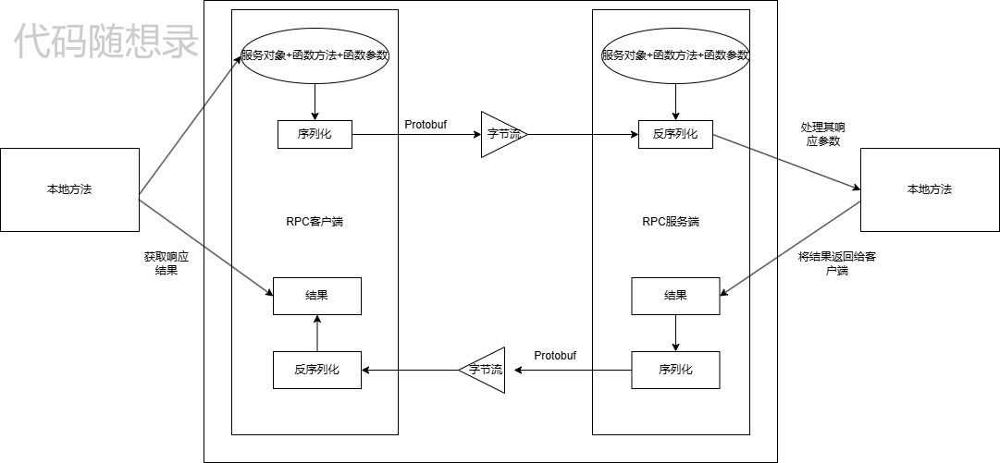
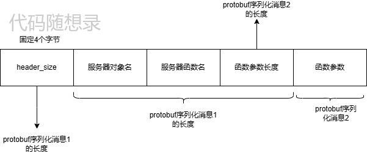

# 3、RPC理论

# 1.为什么要用RPC？

## 什么是 RPC？

RPC（Remote Procedure Call）是一种使程序能够像调用本地函数一样调用远程服务的方法。它屏蔽了底层的通信细节，使得开发人员无需关注远程调用的复杂性，只需像操作本地方法一样调用远程方法。

**参考的博客：**

**Rpc详细笔记(我觉得写的很不错)：**[**https://blog.csdn.net/T\_Solotov/article/details/124107667?spm=1001.2014.3001.5501**](https://blog.csdn.net/T_Solotov/article/details/124107667?spm=1001.2014.3001.5501)

***

## 为什么要用 RPC？

### 简化远程调用的复杂性

在分布式系统中，服务往往部署在不同的机器或网络中。如果没有 RPC，开发人员需要手动编写复杂的网络通信代码，比如：

* 创建和管理连接。
* 数据的序列化和反序列化。
* 请求和响应的发送与接收。
* 错误处理（如超时、断线重连等）。

RPC 对这些底层逻辑进行了封装，开发人员只需专注于业务逻辑，无需关心底层的通信细节。

***

### 2.2 支持微服务架构

随着系统复杂度的增加，微服务架构成为主流。微服务架构的目标是：

* \*\*高内聚、低耦合：\*\*通过将功能拆分成多个独立服务，降低模块之间的依赖。
* \*\*灵活扩展：\*\*各个服务可以独立扩展、部署和更新。

然而，在微服务架构中，不同服务可能部署在不同的机器或网络环境中，需要高效的通信手段。而 RPC 提供了以下支持：

* \*\*跨机器调用：\*\*使服务间的通信像本地调用一样简单。
* \*\*高效传输：\*\*通过高性能序列化协议（如 Protobuf、Thrift）优化数据传输。
* \*\*可靠性保障：\*\*内置的重试机制、超时机制等，确保服务通信的可靠性。

***

### 2.3 提升开发效率

* \*\*抽象通信过程：\*\*通过使用 RPC，开发人员只需定义远程调用的接口（如方法签名），无需实现复杂的通信逻辑。
* **统一接口定义**：大多数 RPC 框架（如 gRPC）提供 IDL（接口描述语言），开发人员只需编写一份接口定义，框架会自动生成客户端和服务端代码。
* \*\*减少出错概率：\*\*通过框架封装复杂的通信逻辑，可以减少手动编写网络代码时的错误（如序列化失败、超时处理不当等）。

***

### 2.4 通用的应用场景

RPC 不仅用于微服务，还在以下场景中广泛应用：

1. **分布式系统：**
   * 解决跨网络的通信问题。
   * 提供一致性调用体验。
2. **跨语言服务调用：**
   * 通过支持多语言（如 gRPC 支持 C++、Java、Python 等），RPC 可以实现跨语言的服务通信。
3. **性能优化：**
   * 利用 RPC 的高性能序列化协议和连接复用能力，减少网络通信开销。
4. **服务间依赖：**
   * 如电商系统中，订单服务调用库存服务，库存服务调用支付服务，RPC 能实现服务间的高效通信。

# 2.RPC远程调用全局概览



* **本地发起远端调用**

本端发起远端调用需要像RPC框架传入请求发服务对象名(可以理解为类对象)、函数方法名（可以理解为类中的成员函数）、函数参数这三样东西。因为我们网络传输使用是TCP协议，而TCP是没有消息边界的字节流，所以我们需要自己处理粘包的问题，即给数据消息自定义数据格式。

* **对应的就说图片中(protobuf)**

序列化技术这里使用的是protobuf，能把一个类似于结构体的消息序列化为二进制数据。

```protobuf
syntax="proto3";
package Krpc;

message RpcHeader{
    bytes service_name=1;
    bytes method_name=2;
    uint32 args_size=3;
}
```

就比如本项目使用的Rpcheader message，这个message就当成一个结构体消息(把bytes当成一个string)。这里可以利用protobuf提供的一个`SerializeToString`能把这个RpcHeader序列化为二进制数据(字符串形式存储)。当我们对这一段二进制数据调用`ParseFromString`，又能完整取出这个结构体消息的每一个字段。(不需要担心三个字段序列化成二进制数据后，每个字段分界的问题，protobuf给你安排的明明白白。)

**本项目是是怎么定义数据消息的传输格式：**



<font style="color:rgb(77, 77, 77);">首先我们有一个protobuf类型的结构体消息RpcHeader，这个RpcHeader有三个字段，分别是服务对象名，服务函数名和函数参数长度。</font>同时我们的函数参数(args)是可变的，长度不确定的，所以不能和Rpcheader一起封装，否则有多个函数就会有多个Rpcheader，所以我们一般是专门在对所需要进行远端调用的函数进行protobuf的封装(比如请求参数和响应参数)，在RpcHeader只封装服务名、函数名、以及参数的大小，具体对来说是进行远端调用函数的request参数的大小，这一部分我建议看代码`exmaple/caller`和`chaneel`、user.proto、Krpcheader.proto理解。

\*\*这里给一个示例方便理解：\
\*\*如果将参数全部写入到Rpcheader：

```cpp
syntax = "proto3";
package Krpc;

// RpcHeader 定义包含参数
message RpcHeader {
    bytes service_name = 1;  // 服务名
    bytes method_name = 2;  // 方法名
    bytes args = 3;         // 序列化后的参数
}
//远程调用函数
message GetUserInfoRequest {
    uint32 user_id = 1;  // 用户 ID
}

message GetUserInfoResponse {
    string user_name = 1;  // 用户名
}

```

客户端代码

```cpp
#include "rpc_header.pb.h"
#include "user.pb.h"

void callGetUserInfo() {
    // 构造请求参数
    GetUserInfoRequest request;
    request.set_user_id(12345);

    // 序列化参数
    std::string serialized_args;
    request.SerializeToString(&serialized_args);

    // 构造 RpcHeader
    RpcHeader header;
    header.set_service_name("UserService");
    header.set_method_name("GetUserInfo");
    header.set_args(serialized_args);

    // 序列化 RpcHeader
    std::string serialized_header;
    header.SerializeToString(&serialized_header);

    // 发送数据（伪代码）
    send(serialized_header);
}

```

服务端代码

```cpp
#include "rpc_header.pb.h"
#include "user.pb.h"

void processRpcCall(const std::string& data) {
    // 反序列化 RpcHeader
    RpcHeader header;
    header.ParseFromString(data);

    // 获取服务名和方法名
    std::string service_name = header.service_name();
    std::string method_name = header.method_name();

    if (service_name == "UserService" && method_name == "GetUserInfo") {
        // 解析参数
        GetUserInfoRequest request;
        request.ParseFromString(header.args());

        // 调用具体逻辑
        GetUserInfoResponse response;
        response.set_user_name("John Doe");  // 假设返回固定值

        // 返回响应（伪代码）
        send(response.SerializeAsString());
    }
}

```

这样是不是就变成了上面所说的调用一个函数就要为其设计一个头部了。

# 3.protobuf

这里建议学习的话可以看看原文档的中文：[这里](https://protobuf.com.cn/programming-guides/proto3/)

## <font style="color:rgb(51, 51, 51);">定义一个消息类型</font>

先来看一个非常简单的例子，假设你想要定义一个“搜索请求的消息格式”，每个请求含有一个查询字符串、你感兴趣的查询结果所在的页数，<font style="color:rgb(51, 51, 51);">，以及每一页多少条查询结果。可以采用如下的方式来定义消息类型的.proto文件了：</font>

```plain
syntax="proto3";
package xxx;//在c++中相当于命名空间，在多人开发下保证命名不会冲突。

message SearchRequest{
    string query=1;
    int32 page_number=2;
    int32 result_per_page=3;
}
```

* <font style="color:rgb(51, 51, 51);">文件的第一行指定了你正在使用proto3语法：如果你没有指定这个，编译器会使用proto2。这个指定语法行必须是文件的非空非注释的第一个行。</font>
* <font style="color:rgb(51, 51, 51);">SearchRequest消息格式有3个字段，在消息中承载的数据分别对应于每一个字段。其中每个字段都有一个名字和一种类型。</font>

当然还有很多内容可以自己参考一下文档。

# 4.RPC异步调用的参考

这里大家有兴趣的话可以查看：[这里](https://melonshell.github.io/2020/01/25/tech4_rpc/)

# 5.Zookeeper

大家可以直接查看这里我觉得这一部分讲的已经很详细了：

2.2.3 [Zookeeper](https://blog.csdn.net/T_Solotov/article/details/124107667?spm=1001.2014.3001.5502)


> 更新: 2024-12-19 10:36:09  
> 原文: <https://www.yuque.com/chengxuyuancarl/hwfg8r/in8g7atdoprh7vuk>