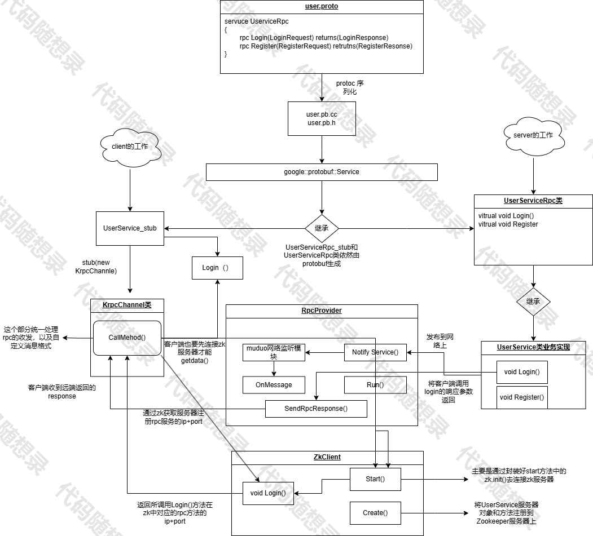

# 5、代码模块

# 本项目代码流程图：



下面会按照这个流程图的顺序分析krpc的代码：

## 1.ProtoBuf协议数据结构定义

RPC通信交互的数据在发送前需要用ProtoBuf进行二进制序列化，并且在通信双方收到后要对二进制序列化数据进行反序列化。双方通信时发送的都是固定结构的消息体，比如登录请求消息体(用户+密码)，注册请求消息体(用户ID+用户名+消息体)。

关于ProtoBuf基本使用方法，前文中有介绍，所以我这里默认你会使用继承的protobuf了。以下是第一版本用的protobuf：

```protobuf
Krpcheader.proto
syntax="proto3";
package Krpc;

message RpcHeader{
  bytes service_name=1;
  bytes method_name=2;
  uint32 args_size=3;
}
///user.proto
syntax="proto3";

package Kuser;

option cc_generic_services=true;

message ResultCode{
    int32 errcode=1;
    bytes errmsg=2;
}
message LoginRequest{
    bytes name=1;
    bytes pwd=2;
}
message LoginResponse{
    ResultCode result=1;
    bool success=2;
}
message RegisterRequest{
    uint32 id=1;
    bytes name=2;
    bytes pwd=3;
}
message RegisterResponse{
    ResultCode result=1;
    bool success=2;
}
service UserServiceRpc{
    rpc Login(LoginRequest) returns(LoginResponse);
    rpc Register(RegisterRequest) returns(RegisterResponse);
}

```

本项目按照上面的框架图来说，就是客户端caller调用远端方法Login和Register。Callee中的Login函数接收一个LoginRequest消息体，执行完Login逻辑后将处理结果填写进LoginResponse消息体，再返回给Caller。调用Register函数的过程同理。

**注：UserServiceRpc代表的是服务吗，login、Register代表的是服务方法。**

```bash
protoc user.proto -I ./ -cpp_out=./user
```

通过这个命令就能生成user.cc和user.h文件。user.cc和user.h里面提供了两个非常重要的类，供c++程序使用，其中UserServiceRpc\_stub类给caller使用，<font style="color:#DF2A3F;">UserServiceRpc\_stub::Login()发起远端调用，而callee则继承UserServiceRpc类并重写UserServiceRpc::Login()函数，实现Login函数调用处理的逻辑。</font>

# 服务端的工作及代码

## 1.服务器的主函数：

```cpp
#include <iostream>
#include <string>
#include "../user.pb.h"
#include "Krpcapplication.h"
#include "Krpcprovider.h"

/*
UserService原来是一个本地服务，提供了两个进程内的本地方法，Login和GetFriendLists
*/
class UserService : public Kuser::UserServiceRpc // 使用在rpc服务发布端（rpc服务提供者）
{
public:
    bool Login(std::string name, std::string pwd)
    {
        std::cout << "doing local service: Login" << std::endl;
        std::cout << "name:" << name << " pwd:" << pwd << std::endl;  
        return true;
    }
    /*
    重写基类UserServiceRpc的虚函数 下面这些方法都是框架直接调用的
    1. caller   ===>   Login(LoginRequest)  => muduo =>   callee 
    2. callee   ===>    Login(LoginRequest)  => 交到下面重写的这个Login方法上了
    */
    void Login(::google::protobuf::RpcController* controller,
                       const ::Kuser::LoginRequest* request,
                       ::Kuser::LoginResponse* response,
                       ::google::protobuf::Closure* done)
    {
        // 框架给业务上报了请求参数LoginRequest，应用获取相应数据做本地业务
        std::string name = request->name();
        std::string pwd = request->pwd();

        // 做本地业务
        bool login_result = Login(name, pwd); 

        // 把响应写入  包括错误码、错误消息、返回值
        Kuser::ResultCode *code = response->mutable_result();
        code->set_errcode(0);
        code->set_errmsg("");
        response->set_success(login_result);

        // 执行回调操作   执行响应对象数据的序列化和网络发送（都是由框架来完成的）
        done->Run();
    }
};

int main(int argc, char **argv)
{
    // 调用框架的初始化操作
    KrpcApplication::Init(argc, argv);

    // provider是一个rpc网络服务对象。把UserService对象发布到rpc节点上
    KrpcProvider provider;
    provider.NotifyService(new UserService());

    // 启动一个rpc服务发布节点   Run以后，进程进入阻塞状态，等待远程的rpc调用请求
    provider.Run();

    return 0;
}
```

简单分析以下：

1.上面的类主要将客户端通过rpc远程调用请求的login方法，进行了处理将其响应的结果返回给客户端(具体是怎么发和怎么返回的接下来会慢慢了解)。

2.主要启动框架初始化(也就是导入我们在bin目录下的test.conf作为可执行程序后面的参数)，其次在`notify()`或者`run()`中涉及到将zookeeper的客户端进行初始化连接到客户端的服务器，将服务器的服务对象UserServiceRpc和其Login、Register及服务器的ip和port发布到zookeeper进行管理，客户端也是一样的通过初始化zookeeper的客户端通过调用的zookeeper服务器，中服务器对象和方法，获取到存放在的ip和port，进行网络socket。通过动态多态就会走到login(）方法这里啦。

***

## 2.为服务器提供服务的函数：

### Krpcapplication.h

```cpp
#ifndef _Krpcapplication_H
#define _Krpcapplication_H
#include "Krpcconfig.h"
#include "Krpcchannel.h" 
#include  "Krpccontroller.h"
#include<mutex>
//Krpc基础类，负责框架的一些初始化操作
class KrpcApplication
{
    public:
    static void Init(int argc,char **argv);
    static KrpcApplication & GetInstance();
    static void deleteInstance();
    static Krpcconfig& GetConfig();
    private:
    static Krpcconfig m_config;
    static KrpcApplication * m_application;//全局唯一单例访问对象
    static std::mutex m_mutex;
    KrpcApplication(){}
    ~KrpcApplication(){}
    KrpcApplication(const KrpcApplication&)=delete;
    KrpcApplication(KrpcApplication&&)=delete;
};
#endif 

```

.cc

```cpp
#include "Krpcapplication.h"
#include<cstdlib>
#include<unistd.h>

Krpcconfig KrpcApplication::m_config;  // 全局配置对象
std::mutex KrpcApplication::m_mutex;  // 用于线程安全的互斥锁
KrpcApplication* KrpcApplication::m_application = nullptr;  // 单例对象指针，初始为空

// 初始化函数，用于解析命令行参数并加载配置文件
void KrpcApplication::Init(int argc, char **argv) {
    if (argc < 2) {  // 如果命令行参数少于2个，说明没有指定配置文件
        std::cout << "格式: command -i <配置文件路径>" << std::endl;
        exit(EXIT_FAILURE);  // 退出程序
    }

    int o;
    std::string config_file;
    // 使用getopt解析命令行参数，-i表示指定配置文件
    while (-1 != (o = getopt(argc, argv, "i:"))) {
        switch (o) {
            case 'i':  // 如果参数是-i，后面的值就是配置文件的路径
                config_file = optarg;  // 将配置文件路径保存到config_file
                break;
            case '?':  // 如果出现未知参数（不是-i），提示正确格式并退出
                std::cout << "格式: command -i <配置文件路径>" << std::endl;
                exit(EXIT_FAILURE);
                break;
            case ':':  // 如果-i后面没有跟参数，提示正确格式并退出
                std::cout << "格式: command -i <配置文件路径>" << std::endl;
                exit(EXIT_FAILURE);
                break;
            default:
                break;
        }
    }

    // 加载配置文件
    m_config.LoadConfigFile(config_file.c_str());
}

// 获取单例对象的引用，保证全局只有一个实例
KrpcApplication &KrpcApplication::GetInstance() {
    std::lock_guard<std::mutex> lock(m_mutex);  // 加锁，保证线程安全
    if (m_application == nullptr) {  // 如果单例对象还未创建
        m_application = new KrpcApplication();  // 创建单例对象
        atexit(deleteInstance);  // 注册atexit函数，程序退出时自动销毁单例对象
    }
    return *m_application;  // 返回单例对象的引用
}

// 程序退出时自动调用的函数，用于销毁单例对象
void KrpcApplication::deleteInstance() {
    if (m_application) {  // 如果单例对象存在
        delete m_application;  // 销毁单例对象
    }
}

// 获取全局配置对象的引用
Krpcconfig& KrpcApplication::GetConfig() {
    return m_config;
}
```

简单讲解：

1.设计模式：单例模式。

2.目的：这里的函数其目的是为了初始化框架，在我们执行可执行程序的时候必须跟上-i 后面存放zookeeper服务器的ip和port及服务器ip和port，并且这里还会调用`m_config.LoadConfigFile(config_file.c_str());`将服务器的ip和port进行存放，并且对其字符串空字符进行删除。

***

## KrpcConfig.h

```cpp
#ifndef _Krpcconfig_h
#define _Krpcconfig_h
#include <unordered_map>
#include <string>
class Krpcconfig{
    public:
    void LoadConfigFile(const char *config_file);//加载配置文件
    std::string Load(const std::string &key);//查找key对应的value
    private:
    std::unordered_map<std::string, std::string> config_map;
    void Trim(std::string &read_buf);//去掉字符串前后的空格
};
#endif

```

.cc

```cpp
#include "Krpcconfig.h"
#include "memory"

// 加载配置文件，解析配置文件中的键值对
void Krpcconfig::LoadConfigFile(const char *config_file) {
    // 使用智能指针管理文件指针，确保文件在退出时自动关闭
    std::unique_ptr<FILE, decltype(&fclose)> pf(
        fopen(config_file, "r"),  // 打开配置文件
        &fclose  // 文件关闭函数
    );

    if (pf == nullptr) {  // 如果文件打开失败
        exit(EXIT_FAILURE);  // 退出程序
    }

    char buf[1024];  // 用于存储从文件中读取的每一行内容
    // 使用pf.get()方法获取原始指针，逐行读取文件内容
    while (fgets(buf, 1024, pf.get()) != nullptr) {
        std::string read_buf(buf);  // 将读取的内容转换为字符串
        Trim(read_buf);  // 去掉字符串前后的空格

        // 忽略注释行（以#开头）和空行
        if (read_buf[0] == '#' || read_buf.empty()) continue;

        // 查找键值对的分隔符'='
        int index = read_buf.find('=');
        if (index == -1) continue;  // 如果没有找到'='，跳过该行

        // 提取键（key）
        std::string key = read_buf.substr(0, index);
        Trim(key);  // 去掉key前后的空格

        // 查找行尾的换行符
        int endindex = read_buf.find('\n', index);
        // 提取值（value），并去掉换行符
        std::string value = read_buf.substr(index + 1, endindex - index - 1);
        Trim(value);  // 去掉value前后的空格

        // 将键值对存入配置map中
        config_map.insert({key, value});
    }
}

// 根据key查找对应的value
std::string Krpcconfig::Load(const std::string &key) {
    auto it = config_map.find(key);  // 在map中查找key
    if (it == config_map.end()) {  // 如果未找到
        return "";  // 返回空字符串
    }
    return it->second;  // 返回对应的value
}

// 去掉字符串前后的空格
void Krpcconfig::Trim(std::string &read_buf) {
    // 去掉字符串前面的空格
    int index = read_buf.find_first_not_of(' ');
    if (index != -1) {  // 如果找到非空格字符
        read_buf = read_buf.substr(index, read_buf.size() - index);  // 截取字符串
    }

    // 去掉字符串后面的空格
    index = read_buf.find_last_not_of(' ');
    if (index != -1) {  // 如果找到非空格字符
        read_buf = read_buf.substr(0, index + 1);  // 截取字符串
    }
}
```

这个函数的逻辑相对简单大家可以自己理解一下。

***

## <font style="color:#DF2A3F;">Krpcprovider.h:</font>

这个也算是服务器的核心函数了，建议好好琢磨思考一下

```cpp
#ifndef _Krpcprovider_H__
#define _Krpcprovider_H__
#include "google/protobuf/service.h"
#include "zookeeperutil.h"
#include<muduo/net/TcpServer.h>
#include<muduo/net/EventLoop.h>
#include<muduo/net/InetAddress.h>
#include<muduo/net/TcpConnection.h>
#include<google/protobuf/descriptor.h>
#include<functional>
#include<string>
#include<unordered_map>

class KrpcProvider
{
public:
    //这里是提供给外部使用的，可以发布rpc方法的函数接口。
    void NotifyService(google::protobuf::Service* service);
      ~KrpcProvider();
    //启动rpc服务节点，开始提供rpc远程网络调用服务
    void Run();
private:
    muduo::net::EventLoop event_loop;
    struct ServiceInfo
    {
        google::protobuf::Service* service;
        std::unordered_map<std::string, const google::protobuf::MethodDescriptor*> method_map;
    };
    std::unordered_map<std::string, ServiceInfo>service_map;//保存服务对象和rpc方法
    
    void OnConnection(const muduo::net::TcpConnectionPtr& conn);
    void OnMessage(const muduo::net::TcpConnectionPtr& conn, muduo::net::Buffer* buffer, muduo::Timestamp receive_time);
    void SendRpcResponse(const muduo::net::TcpConnectionPtr& conn, google::protobuf::Message* response);
};
#endif
```

.cc

```cpp
#include "Krpcprovider.h"
#include "Krpcapplication.h"
#include "Krpcheader.pb.h"
#include "KrpcLogger.h"
#include <iostream>

// 注册服务对象及其方法，以便服务端能够处理客户端的RPC请求
void KrpcProvider::NotifyService(google::protobuf::Service *service) {
    // 服务端需要知道客户端想要调用的服务对象和方法，
    // 这些信息会保存在一个数据结构（如 ServiceInfo）中。
    ServiceInfo service_info;

    // 参数类型设置为 google::protobuf::Service，是因为所有由 protobuf 生成的服务类
    // 都继承自 google::protobuf::Service，这样我们可以通过基类指针指向子类对象，
    // 实现动态多态。

    // 通过动态多态调用 service->GetDescriptor()，
    // GetDescriptor() 方法会返回 protobuf 生成的服务类的描述信息（ServiceDescriptor）。
    const google::protobuf::ServiceDescriptor *psd = service->GetDescriptor();

    // 通过 ServiceDescriptor，我们可以获取该服务类中定义的方法列表，
    // 并进行相应的注册和管理。

    // 获取服务的名字
    std::string service_name = psd->name();
    // 获取服务端对象service的方法数量
    int method_count = psd->method_count();

    // 打印服务名
    std::cout << "service_name=" << service_name << std::endl;

    // 遍历服务中的所有方法，并注册到服务信息中
    for (int i = 0; i < method_count; ++i) {
        // 获取服务中的方法描述
        const google::protobuf::MethodDescriptor *pmd = psd->method(i);
        std::string method_name = pmd->name();
        std::cout << "method_name=" << method_name << std::endl;
        service_info.method_map.emplace(method_name, pmd);  // 将方法名和方法描述符存入map
    }
    service_info.service = service;  // 保存服务对象
    service_map.emplace(service_name, service_info);  // 将服务信息存入服务map
}

// 启动RPC服务节点，开始提供远程网络调用服务
void KrpcProvider::Run() {
    // 读取配置文件中的RPC服务器IP和端口
    std::string ip = KrpcApplication::GetInstance().GetConfig().Load("rpcserverip");
    int port = atoi(KrpcApplication::GetInstance().GetConfig().Load("rpcserverport").c_str());

    // 使用muduo网络库，创建地址对象
    muduo::net::InetAddress address(ip, port);

    // 创建TcpServer对象
    std::shared_ptr<muduo::net::TcpServer> server = std::make_shared<muduo::net::TcpServer>(&event_loop, address, "KrpcProvider");

    // 绑定连接回调和消息回调，分离网络连接业务和消息处理业务
    server->setConnectionCallback(std::bind(&KrpcProvider::OnConnection, this, std::placeholders::_1));
    server->setMessageCallback(std::bind(&KrpcProvider::OnMessage, this, std::placeholders::_1, std::placeholders::_2, std::placeholders::_3));

    // 设置muduo库的线程数量
    server->setThreadNum(4);

    // 将当前RPC节点上要发布的服务全部注册到ZooKeeper上，让RPC客户端可以在ZooKeeper上发现服务
    ZkClient zkclient;
    zkclient.Start();  // 连接ZooKeeper服务器
    // service_name为永久节点，method_name为临时节点
    for (auto &sp : service_map) {
        // service_name 在ZooKeeper中的目录是"/"+service_name
        std::string service_path = "/" + sp.first;
        zkclient.Create(service_path.c_str(), nullptr, 0);  // 创建服务节点
        for (auto &mp : sp.second.method_map) {
            std::string method_path = service_path + "/" + mp.first;
            char method_path_data[128] = {0};
            sprintf(method_path_data, "%s:%d", ip.c_str(), port);  // 将IP和端口信息存入节点数据
            // ZOO_EPHEMERAL表示这个节点是临时节点，在客户端断开连接后，ZooKeeper会自动删除这个节点
            zkclient.Create(method_path.c_str(), method_path_data, strlen(method_path_data), ZOO_EPHEMERAL);
        }
    }

    // RPC服务端准备启动，打印信息
    std::cout << "RpcProvider start service at ip:" << ip << " port:" << port << std::endl;

    // 启动网络服务
    server->start();
    event_loop.loop();  // 进入事件循环
}

// 连接回调函数，处理客户端连接事件
void KrpcProvider::OnConnection(const muduo::net::TcpConnectionPtr &conn) {
    if (!conn->connected()) {
        // 如果连接关闭，则断开连接
        conn->shutdown();
    }
}

// 消息回调函数，处理客户端发送的RPC请求
void KrpcProvider::OnMessage(const muduo::net::TcpConnectionPtr &conn, muduo::net::Buffer *buffer, muduo::Timestamp receive_time) {
    std::cout << "OnMessage" << std::endl;

    // 从网络缓冲区中读取远程RPC调用请求的字符流
    std::string recv_buf = buffer->retrieveAllAsString();

    // 使用protobuf的CodedInputStream反序列化RPC请求
    google::protobuf::io::ArrayInputStream raw_input(recv_buf.data(), recv_buf.size());
    google::protobuf::io::CodedInputStream coded_input(&raw_input);

    uint32_t header_size{};
    coded_input.ReadVarint32(&header_size);  // 解析header_size

    // 根据header_size读取数据头的原始字符流，反序列化数据，得到RPC请求的详细信息
    std::string rpc_header_str;
    Krpc::RpcHeader krpcHeader;
    std::string service_name;
    std::string method_name;
    uint32_t args_size{};

    // 设置读取限制
    google::protobuf::io::CodedInputStream::Limit msg_limit = coded_input.PushLimit(header_size);
    coded_input.ReadString(&rpc_header_str, header_size);
    // 恢复之前的限制，以便安全地继续读取其他数据
    coded_input.PopLimit(msg_limit);

    if (krpcHeader.ParseFromString(rpc_header_str)) {
        service_name = krpcHeader.service_name();
        method_name = krpcHeader.method_name();
        args_size = krpcHeader.args_size();
    } else {
        KrpcLogger::ERROR("krpcHeader parse error");
        return;
    }

    std::string args_str;  // RPC参数
    // 直接读取args_size长度的字符串数据
    bool read_args_success = coded_input.ReadString(&args_str, args_size);
    if (!read_args_success) {
        KrpcLogger::ERROR("read args error");
        return;
    }

    // 获取service对象和method对象
    auto it = service_map.find(service_name);
    if (it == service_map.end()) {
        std::cout << service_name << " is not exist!" << std::endl;
        return;
    }
    auto mit = it->second.method_map.find(method_name);
    if (mit == it->second.method_map.end()) {
        std::cout << service_name << "." << method_name << " is not exist!" << std::endl;
        return;
    }

    google::protobuf::Service *service = it->second.service;  // 获取服务对象
    const google::protobuf::MethodDescriptor *method = mit->second;  // 获取方法对象

    // 生成RPC方法调用请求的request和响应的response参数
    google::protobuf::Message *request = service->GetRequestPrototype(method).New();  // 动态创建请求对象
    if (!request->ParseFromString(args_str)) {
        std::cout << service_name << "." << method_name << " parse error!" << std::endl;
        return;
    }
    google::protobuf::Message *response = service->GetResponsePrototype(method).New();  // 动态创建响应对象

    // 绑定回调函数，用于在方法调用完成后发送响应
    google::protobuf::Closure *done = google::protobuf::NewCallback<KrpcProvider,
                                                                    const muduo::net::TcpConnectionPtr &,
                                                                    google::protobuf::Message *>(this,
                                                                                                 &KrpcProvider::SendRpcResponse,
                                                                                                 conn, response);

    // 在框架上根据远端RPC请求，调用当前RPC节点上发布的方法
    service->CallMethod(method, nullptr, request, response, done);  // 调用服务方法
}

// 发送RPC响应给客户端
void KrpcProvider::SendRpcResponse(const muduo::net::TcpConnectionPtr &conn, google::protobuf::Message *response) {
    std::string response_str;
    if (response->SerializeToString(&response_str)) {
        // 序列化成功，通过网络把RPC方法执行的结果返回给RPC调用方
        conn->send(response_str);
    } else {
        std::cout << "serialize error!" << std::endl;
    }
    // conn->shutdown(); // 模拟HTTP短链接，由RpcProvider主动断开连接
}

// 析构函数，退出事件循环
KrpcProvider::~KrpcProvider() {
    std::cout << "~KrpcProvider()" << std::endl;
    event_loop.quit();  // 退出事件循环
}
```

简单讲解：

在开始讲解之前可以先回忆一下为什么会有这个几个方法，主要是在哪里出现？

很明显啊在我们前面讲的User.proto中服务名是UserServiceRpc的Login方法时，对user.proto进行protoc编译可得<font style="color:rgb(77, 77, 77);">到user.cc和user.h，这组c++文件提供了一个类叫UserServiceRpc，该类中有一个虚方法Login如下所示：</font>

```cpp
/*** user.pb.h ****/
virtual void Login(::PROTOBUF_NAMESPACE_ID::RpcController* controller,
                       const ::fixbug::LoginRequest* request,
                       ::fixbug::LoginResponse* response,
                       ::google::protobuf::Closure* done);

```

这是protobuf为我们提供的接口，需要服务的方法的服务器重写这个Login函数。并在在业务的代码中，我们定义了继承`UserServiceRpc类`的`派生类UserService`。并在UserService重写了这个Login函数。

接着我们在主函数中实例化了一个`Krpcprovide`对象`provider`。(**该类是Rpc架构提供的专门发布Rpc服务的网络对象类**)。接着调用了`provider.NotifyService(new UserService)。`

接下来就是到了我们这个Krpcprovider类了，这个类对外界提供的就是`NotifyService`和`Run`成员方法。其主要作用就是讲服务对象和服务方法进行存储，运行Run方法后将其发布到zookeeper上，等待客户端的获取。**下面会为这个部分的函数进行简单拆分讲解。**

***

### Krpcprovider::NotifyService：

```cpp
// 注册服务对象及其方法，以便服务端能够处理客户端的RPC请求
void KrpcProvider::NotifyService(google::protobuf::Service *service) {
    // 服务端需要知道客户端想要调用的服务对象和方法，
    // 这些信息会保存在一个数据结构（如 ServiceInfo）中。
    ServiceInfo service_info;

    // 参数类型设置为 google::protobuf::Service，是因为所有由 protobuf 生成的服务类
    // 都继承自 google::protobuf::Service，这样我们可以通过基类指针指向子类对象，
    // 实现动态多态。

    // 通过动态多态调用 service->GetDescriptor()，
    // GetDescriptor() 方法会返回 protobuf 生成的服务类的描述信息（ServiceDescriptor）。
    const google::protobuf::ServiceDescriptor *psd = service->GetDescriptor();

    // 通过 ServiceDescriptor，我们可以获取该服务类中定义的方法列表，
    // 并进行相应的注册和管理。

    // 获取服务的名字
    std::string service_name = psd->name();
    // 获取服务端对象service的方法数量
    int method_count = psd->method_count();

    // 打印服务名
    std::cout << "service_name=" << service_name << std::endl;

    // 遍历服务中的所有方法，并注册到服务信息中
    for (int i = 0; i < method_count; ++i) {
        // 获取服务中的方法描述
        const google::protobuf::MethodDescriptor *pmd = psd->method(i);
        std::string method_name = pmd->name();
        std::cout << "method_name=" << method_name << std::endl;
        service_info.method_map.emplace(method_name, pmd);  // 将方法名和方法描述符存入map
    }
    service_info.service = service;  // 保存服务对象
    service_map.emplace(service_name, service_info);  // 将服务信息存入服务map
}
```

所以经过上面讲的相信大家已经理解这个类具体做啥了。其目的就是为了存储UserServiceRpc服务器对象以及其方法。

但是这里存在一个细节就是动态多态，这里虽然传入的参数是`google::protobuf::Service *service`但实际上传入的是用户生成的UserService，但是UserService是继承的user.proto生成的UserServiceRpc的login虚函数方法的重写，说白了就是一个很明显的动态多态。

### Krpcprovider::Run()

```cpp
// 启动RPC服务节点，开始提供远程网络调用服务
void KrpcProvider::Run() {
    // 读取配置文件中的RPC服务器IP和端口
    std::string ip = KrpcApplication::GetInstance().GetConfig().Load("rpcserverip");
    int port = atoi(KrpcApplication::GetInstance().GetConfig().Load("rpcserverport").c_str());

    // 使用muduo网络库，创建地址对象
    muduo::net::InetAddress address(ip, port);

    // 创建TcpServer对象
    std::shared_ptr<muduo::net::TcpServer> server = std::make_shared<muduo::net::TcpServer>(&event_loop, address, "KrpcProvider");

    // 绑定连接回调和消息回调，分离网络连接业务和消息处理业务
    server->setConnectionCallback(std::bind(&KrpcProvider::OnConnection, this, std::placeholders::_1));
    server->setMessageCallback(std::bind(&KrpcProvider::OnMessage, this, std::placeholders::_1, std::placeholders::_2, std::placeholders::_3));

    // 设置muduo库的线程数量
    server->setThreadNum(4);

    // 将当前RPC节点上要发布的服务全部注册到ZooKeeper上，让RPC客户端可以在ZooKeeper上发现服务
    ZkClient zkclient;
    zkclient.Start();  // 连接ZooKeeper服务器
    // service_name为永久节点，method_name为临时节点
    for (auto &sp : service_map) {
        // service_name 在ZooKeeper中的目录是"/"+service_name
        std::string service_path = "/" + sp.first;
        zkclient.Create(service_path.c_str(), nullptr, 0);  // 创建服务节点
        for (auto &mp : sp.second.method_map) {
            std::string method_path = service_path + "/" + mp.first;
            char method_path_data[128] = {0};
            sprintf(method_path_data, "%s:%d", ip.c_str(), port);  // 将IP和端口信息存入节点数据
            // ZOO_EPHEMERAL表示这个节点是临时节点，在客户端断开连接后，ZooKeeper会自动删除这个节点
            zkclient.Create(method_path.c_str(), method_path_data, strlen(method_path_data), ZOO_EPHEMERAL);
        }
    }

    // RPC服务端准备启动，打印信息
    std::cout << "RpcProvider start service at ip:" << ip << " port:" << port << std::endl;

    // 启动网络服务
    server->start();
    event_loop.loop();  // 进入事件循环
}
```

简单分析：

1.配置文件加载

作用：通过`KrpcApplication`单例对象的配置管理模块加载RPC服务的IP和Port端口。

2.muduo库的学习的了这个前面的部分有讲过和学习的资料啥的，建议自助学习一下。

3.ZooKeeper的详细等等下面的部分会详细提及，这里的作用就是将服务器对象和服务器方法及ip和port存放到zookeeper的服务器上。

* **作用**: 将当前服务节点的信息注册到 ZooKeeper，供客户端发现服务。
* **关键点**:
* **ZK 客户端启动**: 初始化 `ZkClient` 并启动与 ZooKeeper 的连接。
* **注册服务路径**:
  * 服务名称对应的永久节点路径：`/service_name`。
  * 方法名称对应的临时节点路径：`/service_name/method_name`。
* **临时节点**: 使用 `ZOO_EPHEMERAL` 标志，节点会在服务断开时自动删除。

4.启动网络服务

```cpp
std::cout << "RpcProvider start service at ip:" << ip << " port:" << port << std::endl;
server->start();
event_loop.loop();
```

作用:启动RPC服务。

关键点：

* 打印服务启动日志，方便调试。
* 调用 `server->start()` 启动 `TcpServer`。
* 调用 `event_loop.loop()` 开始事件循环，监听和处理客户端请求。

### Krpcprovider::OnMessage：

在RpcProvider::Run()函数中会用Muduo库提供网络模块监听Callee端的rpcserver的端口。当会对callee的rpcserver发起tcp连接，rpcserver接收连接后，开启对客户端连接描述符的可读事件监听。caller将请求的服务方法及参数发给callee的rpcserver，此时rpcsercer上的muduo网络模块监听到该连接可读事件，然后就执行`OnMessage（）`函数逻辑。

```cpp
// 消息回调函数，处理客户端发送的RPC请求
void KrpcProvider::OnMessage(const muduo::net::TcpConnectionPtr &conn, muduo::net::Buffer *buffer, muduo::Timestamp receive_time) {
    std::cout << "OnMessage" << std::endl;

    // 从网络缓冲区中读取远程RPC调用请求的字符流
    std::string recv_buf = buffer->retrieveAllAsString();

    // 使用protobuf的CodedInputStream反序列化RPC请求
    google::protobuf::io::ArrayInputStream raw_input(recv_buf.data(), recv_buf.size());
    google::protobuf::io::CodedInputStream coded_input(&raw_input);

    uint32_t header_size{};
    coded_input.ReadVarint32(&header_size);  // 解析header_size

    // 根据header_size读取数据头的原始字符流，反序列化数据，得到RPC请求的详细信息
    std::string rpc_header_str;
    Krpc::RpcHeader krpcHeader;
    std::string service_name;
    std::string method_name;
    uint32_t args_size{};

    // 设置读取限制
    google::protobuf::io::CodedInputStream::Limit msg_limit = coded_input.PushLimit(header_size);
    coded_input.ReadString(&rpc_header_str, header_size);
    // 恢复之前的限制，以便安全地继续读取其他数据
    coded_input.PopLimit(msg_limit);

    if (krpcHeader.ParseFromString(rpc_header_str)) {
        service_name = krpcHeader.service_name();
        method_name = krpcHeader.method_name();
        args_size = krpcHeader.args_size();
    } else {
        KrpcLogger::ERROR("krpcHeader parse error");
        return;
    }

    std::string args_str;  // RPC参数
    // 直接读取args_size长度的字符串数据
    bool read_args_success = coded_input.ReadString(&args_str, args_size);
    if (!read_args_success) {
        KrpcLogger::ERROR("read args error");
        return;
    }

    // 获取service对象和method对象
    auto it = service_map.find(service_name);
    if (it == service_map.end()) {
        std::cout << service_name << " is not exist!" << std::endl;
        return;
    }
    auto mit = it->second.method_map.find(method_name);
    if (mit == it->second.method_map.end()) {
        std::cout << service_name << "." << method_name << " is not exist!" << std::endl;
        return;
    }

    google::protobuf::Service *service = it->second.service;  // 获取服务对象
    const google::protobuf::MethodDescriptor *method = mit->second;  // 获取方法对象

    // 生成RPC方法调用请求的request和响应的response参数
    google::protobuf::Message *request = service->GetRequestPrototype(method).New();  // 动态创建请求对象
    if (!request->ParseFromString(args_str)) {
        std::cout << service_name << "." << method_name << " parse error!" << std::endl;
        return;
    }
    google::protobuf::Message *response = service->GetResponsePrototype(method).New();  // 动态创建响应对象

    // 绑定回调函数，用于在方法调用完成后发送响应
    google::protobuf::Closure *done = google::protobuf::NewCallback<KrpcProvider,
                                                                    const muduo::net::TcpConnectionPtr &,
                                                                    google::protobuf::Message *>(this,
                                                                                                 &KrpcProvider::SendRpcResponse,
                                                                                                 conn, response);

    // 在框架上根据远端RPC请求，调用当前RPC节点上发布的方法
    service->CallMethod(method, nullptr, request, response, done);  // 调用服务方法
}

```

\*\*重：\*\*这里提及其中一个重要的部分最后这个NewCallback的模板函数，并且返回一个`google::protobuf::Closuer`类的对象，该Closure类其实相当于一个闭包。这个闭包捕获成员对象的成员函数。<font style="color:rgb(77, 77, 77);">也就是相当于执行</font><code><font style="color:rgb(199, 37, 78);background-color:rgb(249, 242, 244);">void RpcProvider::SendRpcResponse(conn, response);</font></code><font style="color:rgb(77, 77, 77);">，这个函数可以将reponse消息体发送给Tcp连接的另一端，即caller。</font>

***

## Zookeeper：

.h

```cpp
#ifndef _zookeeperutil_h_
#define _zookeeperutil_h_

#include<semaphore.h>
#include<zookeeper/zookeeper.h>
#include<string>

//封装的zk客户端
class ZkClient
{
public:
    ZkClient();
    ~ZkClient();
    //zkclient启动连接zkserver
    void Start();
    //在zkserver中创建一个节点，根据指定的path
    void Create(const char* path,const char* data,int datalen,int state=0);
    //根据参数指定的znode节点路径，或者znode节点值
    std::string GetData(const char* path);
private:
    //Zk的客户端句柄
    zhandle_t* m_zhandle;
};
#endif
```

.cc

```cpp
#include "zookeeperutil.h"
#include "Krpcapplication.h"
#include <mutex>
#include "KrpcLogger.h"
#include <condition_variable>

std::mutex cv_mutex;        // 全局锁，用于保护共享变量的线程安全
std::condition_variable cv; // 条件变量，用于线程间通信
bool is_connected = false;  // 标记ZooKeeper客户端是否连接成功

// 全局的watcher观察器，用于接收ZooKeeper服务器的通知
void global_watcher(zhandle_t *zh, int type, int status, const char *path, void *watcherCtx) {
    if (type == ZOO_SESSION_EVENT) {  // 回调消息类型和会话相关的事件
        if (status == ZOO_CONNECTED_STATE) {  // ZooKeeper客户端和服务器连接成功
            std::lock_guard<std::mutex> lock(cv_mutex);  // 加锁保护
            is_connected = true;  // 标记连接成功
        }
    }
    cv.notify_all();  // 通知所有等待的线程
}

// 构造函数，初始化ZooKeeper客户端句柄为空
ZkClient::ZkClient() : m_zhandle(nullptr) {}

// 析构函数，关闭ZooKeeper连接
ZkClient::~ZkClient() {
    if (m_zhandle != nullptr) {
        zookeeper_close(m_zhandle);  // 关闭ZooKeeper连接
    }
}

// 启动ZooKeeper客户端，连接ZooKeeper服务器
void ZkClient::Start() {
    // 从配置文件中读取ZooKeeper服务器的IP和端口
    std::string host = KrpcApplication::GetInstance().GetConfig().Load("zookeeperip");
    std::string port = KrpcApplication::GetInstance().GetConfig().Load("zookeeperport");
    std::string connstr = host + ":" + port;  // 拼接连接字符串

    /*
    zookeeper_mt：多线程版本
    ZooKeeper的API客户端程序提供了三个线程：
    1. API调用线程
    2. 网络I/O线程（使用pthread_create和poll）
    3. watcher回调线程（使用pthread_create）
    */

    // 使用zookeeper_init初始化一个ZooKeeper客户端对象，异步建立与服务器的连接
    m_zhandle = zookeeper_init(connstr.c_str(), global_watcher, 6000, nullptr, nullptr, 0);
    if (nullptr == m_zhandle) {  // 初始化失败
        LOG(ERROR) << "zookeeper_init error";
        exit(EXIT_FAILURE);  // 退出程序
    }

    // 等待连接成功
    std::unique_lock<std::mutex> lock(cv_mutex);
    cv.wait(lock, [] { return is_connected; });  // 阻塞等待，直到连接成功
    LOG(INFO) << "zookeeper_init success";  // 记录日志，表示连接成功
}

// 创建ZooKeeper节点
void ZkClient::Create(const char *path, const char *data, int datalen, int state) {
    char path_buffer[128];  // 用于存储创建的节点路径
    int bufferlen = sizeof(path_buffer);

    // 检查节点是否已经存在
    int flag = zoo_exists(m_zhandle, path, 0, nullptr);
    if (flag == ZNONODE) {  // 如果节点不存在
        // 创建指定的ZooKeeper节点
        flag = zoo_create(m_zhandle, path, data, datalen, &ZOO_OPEN_ACL_UNSAFE, state, path_buffer, bufferlen);
        if (flag == ZOK) {  // 创建成功
            LOG(INFO) << "znode create success... path:" << path;
        } else {  // 创建失败
            LOG(ERROR) << "znode create failed... path:" << path;
            exit(EXIT_FAILURE);  // 退出程序
        }
    }
}

// 获取ZooKeeper节点的数据
std::string ZkClient::GetData(const char *path) {
    char buf[64];  // 用于存储节点数据
    int bufferlen = sizeof(buf);

    // 获取指定节点的数据
    int flag = zoo_get(m_zhandle, path, 0, buf, &bufferlen, nullptr);
    if (flag != ZOK) {  // 获取失败
        LOG(ERROR) << "zoo_get error";
        return "";  // 返回空字符串
    } else {  // 获取成功
        return buf;  // 返回节点数据
    }
    return "";  // 默认返回空字符串
}
```

这部分的代码逻辑上也不难，但是需要注意的是`zookeeper_init(connstr.c_str(),global_watcher,30000,nullptr,nullptr,0);`这个部分这里下面还涉及到c++11新增的信号量和锁的阻塞当前等主线程，**等ZooKeeper服务端收到来自客户端callee的连接请求后，服务端为节点创建会话(此时这个节点状态发生改变)，服务器会返回给客户端callee一个事件通知，然后出发watcher回调(执行global\_watcher函数).**

问题：

但是细心的人就要说了看这个<code>zoo_get(m_zhandle,path,0,buf,&bufferlen,nullptr);</code>这里面不是0嘛？你也没启用watcher监控节点数据的获取变化，或者Create中获监控节点是否被创建的变化。

对的，我们这里只是做了`global_watcher`监听连接会话相关事件(连接成功)，当客户端与服务器连接成功时，通过信号量接触阻塞，通知主线程连接已完成。

**<font style="color:rgb(77, 77, 77);">这个同步机制保证了，当</font>**<code>**<font style="color:rgb(199, 37, 78);background-color:rgb(249, 242, 244);">ZkClient::Start()</font>**</code>**<font style="color:rgb(77, 77, 77);">执行完后，callee端确定和zookeeper服务端建立好了连接！</font>**

## Krpccontroller：

这个内容比较简单，可以自行阅读。

***

**不容易啊，感觉代码不多话也不多怎么看起来那么累人呢？**

***

***

带着上面的疑惑赶紧加练客户！

# 客户端

## 客户端的主函数：

不管是客户端还是服务端都可以发现都是用了`KrpcApplication::Init`这里很正常因为服务器需要获取直接的ip和port，**客户端需要访问到zookeeper的ip和port，服务器需要获取到自己发布到网上的ip和port以及zookeeper的ip和port将服务对象和方法进行发布。**

```cpp
#include "Krpcapplication.h"
#include "../user.pb.h"
#include "Krpccontroller.h"
#include <iostream>
#include <atomic>
#include <thread>
#include <chrono>
#include "KrpcLogger.h"

// 发送 RPC 请求的函数，模拟客户端调用远程服务
void send_request(int thread_id, std::atomic<int> &success_count, std::atomic<int> &fail_count) {
    // 创建一个 UserServiceRpc_Stub 对象，用于调用远程的 RPC 方法
    Kuser::UserServiceRpc_Stub stub(new KrpcChannel(false));

    // 设置 RPC 方法的请求参数
    Kuser::LoginRequest request;
    request.set_name("zhangsan");  // 设置用户名
    request.set_pwd("123456");    // 设置密码

    // 定义 RPC 方法的响应参数
    Kuser::LoginResponse response;
    Krpccontroller controller;  // 创建控制器对象，用于处理 RPC 调用过程中的错误

    // 调用远程的 Login 方法
    stub.Login(&controller, &request, &response, nullptr);

    // 检查 RPC 调用是否成功
    if (controller.Failed()) {  // 如果调用失败
        std::cout << controller.ErrorText() << std::endl;  // 打印错误信息
        fail_count++;  // 失败计数加 1
    } else {  // 如果调用成功
        if (0 == response.result().errcode()) {  // 检查响应中的错误码
            std::cout << "rpc login response success:" << response.success() << std::endl;  // 打印成功信息
            success_count++;  // 成功计数加 1
        } else {  // 如果响应中有错误
            std::cout << "rpc login response error : " << response.result().errmsg() << std::endl;  // 打印错误信息
            fail_count++;  // 失败计数加 1
        }
    }
}

int main(int argc, char **argv) {
    // 初始化 RPC 框架，解析命令行参数并加载配置文件
    KrpcApplication::Init(argc, argv);

    // 创建日志对象
    KrpcLogger logger("MyRPC");

    const int thread_count = 10;       // 并发线程数
    const int requests_per_thread = 1; // 每个线程发送的请求数

    std::vector<std::thread> threads;  // 存储线程对象的容器
    std::atomic<int> success_count(0); // 成功请求的计数器
    std::atomic<int> fail_count(0);    // 失败请求的计数器

    auto start_time = std::chrono::high_resolution_clock::now();  // 记录测试开始时间

    // 启动多线程进行并发测试
    for (int i = 0; i < thread_count; i++) {
        threads.emplace_back([argc, argv, i, &success_count, &fail_count, requests_per_thread]() {
            for (int j = 0; j < requests_per_thread; j++) {
                send_request(i, success_count, fail_count);  // 每个线程发送指定数量的请求
            }
        });
    }

    // 等待所有线程执行完毕
    for (auto &t : threads) {
        t.join();
    }

    auto end_time = std::chrono::high_resolution_clock::now();  // 记录测试结束时间
    std::chrono::duration<double> elapsed = end_time - start_time;  // 计算测试耗时

    // 输出统计结果
    LOG(INFO) << "Total requests: " << thread_count * requests_per_thread;  // 总请求数
    LOG(INFO) << "Success count: " << success_count;  // 成功请求数
    LOG(INFO) << "Fail count: " << fail_count;  // 失败请求数
    LOG(INFO) << "Elapsed time: " << elapsed.count() << " seconds";  // 测试耗时
    LOG(INFO) << "QPS: " << (thread_count * requests_per_thread) / elapsed.count();  // 计算 QPS（每秒请求数）

    return 0;
}
```

简单讲解：\
如果这里你学习完了前置的rpc理论部分，这里我就简单补充一些内容：

proto生成的UserServiceRpc\_Stub 类是给caller端使用的，而且我们在user.proto上注册的rpc方法已经在UserServiceRpc\_Stub类中完全实现。我们来看看，其如何实现直接打开user.cc文件：

```cpp
void UserServiceRpc_Stub::Login(::PROTOBUF_NAMESPACE_ID::RpcController* controller,
                              const ::fixbug::LoginRequest* request,
                              ::fixbug::LoginResponse* response,
                              ::google::protobuf::Closure* done) {
  channel_->CallMethod(descriptor()->method(0),
                       controller, request, response, done);
}

```

可以看到，由protobuf生成的供caller调用的RPC方法其实里面都调用了`channel_CallMethod（）`，继续深入下去发现channel\_是RrpcChannel类，RpcChannel类是一个虚函数，里面有一个虚方法`CallMethod()`,也就是说，我们用户需要自己实现一个继承于RpcChannel的派生类，这个派生类要实现`CallMethod()`的定义。

## 客户端的相关函数

## KrpcChannel

.h

```cpp
#ifndef _Krpcchannel_h_
#define _Krpcchannel_h_
// 此类是继承自google::protobuf::RpcChannel
// 目的是为了给客户端进行方法调用的时候，统一接收的
#include <google/protobuf/service.h>
#include "zookeeperutil.h"
class KrpcChannel : public google::protobuf::RpcChannel
{
public:
    KrpcChannel(bool connectNow);
    virtual ~KrpcChannel()
    {
    }
    void CallMethod(const ::google::protobuf::MethodDescriptor *method,
                    ::google::protobuf::RpcController *controller,
                    const ::google::protobuf::Message *request,
                    ::google::protobuf::Message *response,
                    ::google::protobuf::Closure *done) override; // override可以验证是否是虚函数
private:
    int m_clientfd; // 存放客户端套接字
    std::string service_name;
    std::string m_ip;
    uint16_t m_port;
    std::string method_name;
    int m_idx; // 用来划分服务器ip和port的下标
    bool newConnect(const char *ip, uint16_t port);
    std::string QueryServiceHost(ZkClient *zkclient, std::string service_name, std::string method_name, int &idx);
};
#endif

```

.cc

```cpp
#include "Krpcchannel.h"
#include "Krpcheader.pb.h"
#include "zookeeperutil.h"
#include "Krpcapplication.h"
#include "Krpccontroller.h"
#include "memory"
#include <errno.h>
#include <unistd.h>
#include <sys/socket.h>
#include <sys/types.h>
#include <arpa/inet.h>
#include "KrpcLogger.h"

std::mutex g_data_mutx;  // 全局互斥锁，用于保护共享数据的线程安全

// RPC调用的核心方法，负责将客户端的请求序列化并发送到服务端，同时接收服务端的响应
void KrpcChannel::CallMethod(const ::google::protobuf::MethodDescriptor *method,
                             ::google::protobuf::RpcController *controller,
                             const ::google::protobuf::Message *request,
                             ::google::protobuf::Message *response,
                             ::google::protobuf::Closure *done)
{
    if (-1 == m_clientfd) {  // 如果客户端socket未初始化
        // 获取服务对象名和方法名
        const google::protobuf::ServiceDescriptor *sd = method->service();
        service_name = sd->name();  // 服务名
        method_name = method->name();  // 方法名

        // 客户端需要查询ZooKeeper，找到提供该服务的服务器地址
        ZkClient zkCli;
        zkCli.Start();  // 连接ZooKeeper服务器
        std::string host_data = QueryServiceHost(&zkCli, service_name, method_name, m_idx);  // 查询服务地址
        m_ip = host_data.substr(0, m_idx);  // 从查询结果中提取IP地址
        std::cout << "ip: " << m_ip << std::endl;
        m_port = atoi(host_data.substr(m_idx + 1, host_data.size() - m_idx).c_str());  // 从查询结果中提取端口号
        std::cout << "port: " << m_port << std::endl;

        // 尝试连接服务器
        auto rt = newConnect(m_ip.c_str(), m_port);
        if (!rt) {
            LOG(ERROR) << "connect server error";  // 连接失败，记录错误日志
            return;
        } else {
            LOG(INFO) << "connect server success";  // 连接成功，记录日志
        }
    }  // endif

    // 将请求参数序列化为字符串，并计算其长度
    uint32_t args_size{};
    std::string args_str;
    if (request->SerializeToString(&args_str)) {  // 序列化请求参数
        args_size = args_str.size();  // 获取序列化后的长度
    } else {
        controller->SetFailed("serialize request fail");  // 序列化失败，设置错误信息
        return;
    }

    // 定义RPC请求的头部信息
    Krpc::RpcHeader krpcheader;
    krpcheader.set_service_name(service_name);  // 设置服务名
    krpcheader.set_method_name(method_name);  // 设置方法名
    krpcheader.set_args_size(args_size);  // 设置参数长度

    // 将RPC头部信息序列化为字符串，并计算其长度
    uint32_t header_size = 0;
    std::string rpc_header_str;
    if (krpcheader.SerializeToString(&rpc_header_str)) {  // 序列化头部信息
        header_size = rpc_header_str.size();  // 获取序列化后的长度
    } else {
        controller->SetFailed("serialize rpc header error!");  // 序列化失败，设置错误信息
        return;
    }

    // 将头部长度和头部信息拼接成完整的RPC请求报文
    std::string send_rpc_str;
    {
        google::protobuf::io::StringOutputStream string_output(&send_rpc_str);
        google::protobuf::io::CodedOutputStream coded_output(&string_output);
        coded_output.WriteVarint32(static_cast<uint32_t>(header_size));  // 写入头部长度
        coded_output.WriteString(rpc_header_str);  // 写入头部信息
    }
    send_rpc_str += args_str;  // 拼接请求参数

    // 发送RPC请求到服务器
    if (-1 == send(m_clientfd, send_rpc_str.c_str(), send_rpc_str.size(), 0)) {
        close(m_clientfd);  // 发送失败，关闭socket
        char errtxt[512] = {};
        std::cout << "send error: " << strerror_r(errno, errtxt, sizeof(errtxt)) << std::endl;  // 打印错误信息
        controller->SetFailed(errtxt);  // 设置错误信息
        return;
    }

    // 接收服务器的响应
    char recv_buf[1024] = {0};
    int recv_size = 0;
    if (-1 == (recv_size = recv(m_clientfd, recv_buf, 1024, 0))) {
        char errtxt[512] = {};
        std::cout << "recv error" << strerror_r(errno, errtxt, sizeof(errtxt)) << std::endl;  // 打印错误信息
        controller->SetFailed(errtxt);  // 设置错误信息
        return;
    }

    // 将接收到的响应数据反序列化为response对象
    if (!response->ParseFromArray(recv_buf, recv_size)) {
        close(m_clientfd);  // 反序列化失败，关闭socket
        char errtxt[512] = {};
        std::cout << "parse error" << strerror_r(errno, errtxt, sizeof(errtxt)) << std::endl;  // 打印错误信息
        controller->SetFailed(errtxt);  // 设置错误信息
        return;
    }

    close(m_clientfd);  // 关闭socket连接
}

// 创建新的socket连接
bool KrpcChannel::newConnect(const char *ip, uint16_t port) {
    // 创建socket
    int clientfd = socket(AF_INET, SOCK_STREAM, 0);
    if (-1 == clientfd) {
        char errtxt[512] = {0};
        std::cout << "socket error" << strerror_r(errno, errtxt, sizeof(errtxt)) << std::endl;  // 打印错误信息
        LOG(ERROR) << "socket error:" << errtxt;  // 记录错误日志
        return false;
    }

    // 设置服务器地址信息
    struct sockaddr_in server_addr;
    server_addr.sin_family = AF_INET;  // IPv4地址族
    server_addr.sin_port = htons(port);  // 端口号
    server_addr.sin_addr.s_addr = inet_addr(ip);  // IP地址

    // 尝试连接服务器
    if (-1 == connect(clientfd, (struct sockaddr *)&server_addr, sizeof(server_addr))) {
        close(clientfd);  // 连接失败，关闭socket
        char errtxt[512] = {0};
        std::cout << "connect error" << strerror_r(errno, errtxt, sizeof(errtxt)) << std::endl;  // 打印错误信息
        LOG(ERROR) << "connect server error" << errtxt;  // 记录错误日志
        return false;
    }

    m_clientfd = clientfd;  // 保存socket文件描述符
    return true;
}

// 从ZooKeeper查询服务地址
std::string KrpcChannel::QueryServiceHost(ZkClient *zkclient, std::string service_name, std::string method_name, int &idx) {
    std::string method_path = "/" + service_name + "/" + method_name;  // 构造ZooKeeper路径
    std::cout << "method_path: " << method_path << std::endl;

    std::unique_lock<std::mutex> lock(g_data_mutx);  // 加锁，保证线程安全
    std::string host_data_1 = zkclient->GetData(method_path.c_str());  // 从ZooKeeper获取数据
    lock.unlock();  // 解锁

    if (host_data_1 == "") {  // 如果未找到服务地址
        LOG(ERROR) << method_path + " is not exist!";  // 记录错误日志
        return " ";
    }

    idx = host_data_1.find(":");  // 查找IP和端口的分隔符
    if (idx == -1) {  // 如果分隔符不存在
        LOG(ERROR) << method_path + " address is invalid!";  // 记录错误日志
        return " ";
    }

    return host_data_1;  // 返回服务地址
}

// 构造函数，支持延迟连接
KrpcChannel::KrpcChannel(bool connectNow) : m_clientfd(-1), m_idx(0) {
    if (!connectNow) {  // 如果不需要立即连接
        return;
    }

    // 尝试连接服务器，最多重试3次
    auto rt = newConnect(m_ip.c_str(), m_port);
    int count = 3;  // 重试次数
    while (!rt && count--) {
        rt = newConnect(m_ip.c_str(), m_port);
    }
}
```

简单讲解：

完成以下流程：

1. 根据 `method` 获取服务名和方法名。
2. 序列化 `request` 和额外的 RPC 头信息，构造完整的 RPC 请求包。
3. 通过 ZooKeeper 查询服务的具体地址。
4. 与服务端建立连接，发送 RPC 请求。
5. 接收响应，反序列化到 `response`。
6. 增加了重试机制。

\*\*注：\*\*构建头部的部分前面的rpc理论模块中提及到了，然后这里的序列化原理比较简单就是转换成string网络字节序进行传输，后面可能会进行替换遇到大数据这个序列化方式不太好。

**补：**   `   std::string method_path = "/" + service_name + "/" + method_name;`如果有人对这里有疑惑我前面的理论其实贴过某不错的笔记这里再贴一次：[这里](https://blog.csdn.net/T_Solotov/article/details/124107667?spm=1001.2014.3001.5502)

**补充：**

\*\*   \*\*`std::unique_lock<std::mutex> lock(g_data_mutx);`在Channel中为什么要加锁因为由于我们在客户端写了一个多并发的测试意味着，会有多个线程去访问这个Channel，大家都需要通过zk客户端，拿到zk服务器里我们注册好的服务器ip和port，服务名和方法名等。这里需要保护保证每一个线程都能拿到资源否则就会出现问题。

具体如下：

```cpp
// 启动多线程进行并发测试
    for (int i = 0; i < thread_count; i++)
    {
        threads.emplace_back([argc, argv, i, &success_count, &fail_count, requests_per_thread]()
                             {
        for(int j=0;j<requests_per_thread;j++)
        {
          send_request(i,success_count,fail_count);
        } });
    }
//Channel类
ZkClient zkCli;
    zkCli.Start(); // start返回就代表成功连接上zk服务器了
    std::string host_data=QueryServiceHost(&zkCli, service_name, method_name,m_idx);
    m_ip= host_data.substr(0, m_idx);
    std::cout << "ip: " << m_ip << std::endl;
    m_port = atoi(host_data.substr(m_idx + 1, host_data.size() - m_idx).c_str());
    std::cout << "port: " << m_port << std::endl;
//...省略了代码
//获取服务对象
std::string KrpcChannel::QueryServiceHost(ZkClient *zkclient,std::string service_name,std::string method_name,int& idx){
    std::string method_path = "/" + service_name + "/" + method_name;
    std::cout << "method_path: " << method_path << std::endl;
    std::unique_lock<std::mutex> lock(g_data_mutx);
    std::string host_data_1 = zkclient->GetData(method_path.c_str());
    lock.unlock(); 
    if (host_data_1 == "")
    {
        LOG(ERROR)<< method_path + " is not exist!";
        return" ";
    }
    idx = host_data_1.find(":"); // 127.0.0.1:8000 获取到ip和port的分割符
    if (idx == -1)
    {
        LOG(ERROR)<< method_path + " address is invalid!";
        return" ";
    }
    return host_data_1;
}
```


> 更新: 2025-03-14 16:02:52  
> 原文: <https://www.yuque.com/chengxuyuancarl/hwfg8r/aq6txkzzc1dh58gh>